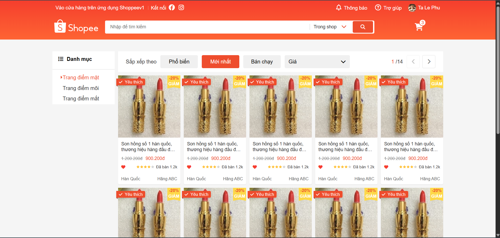
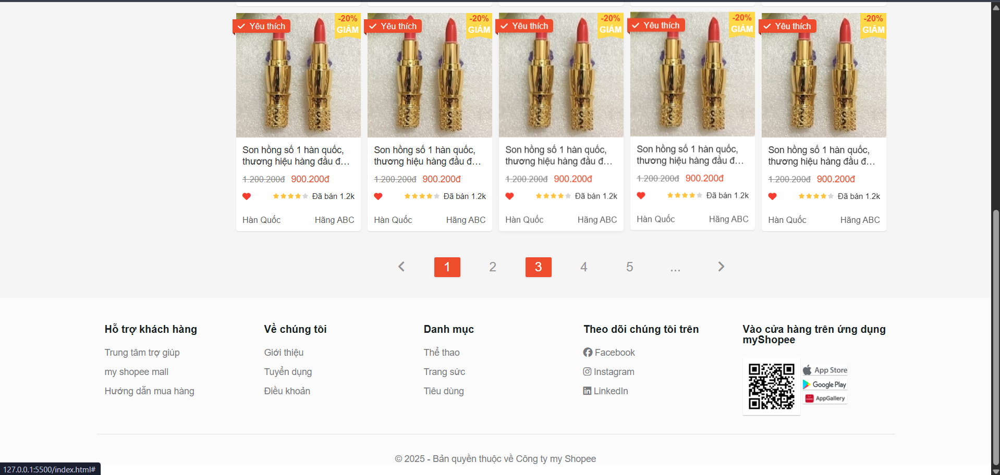
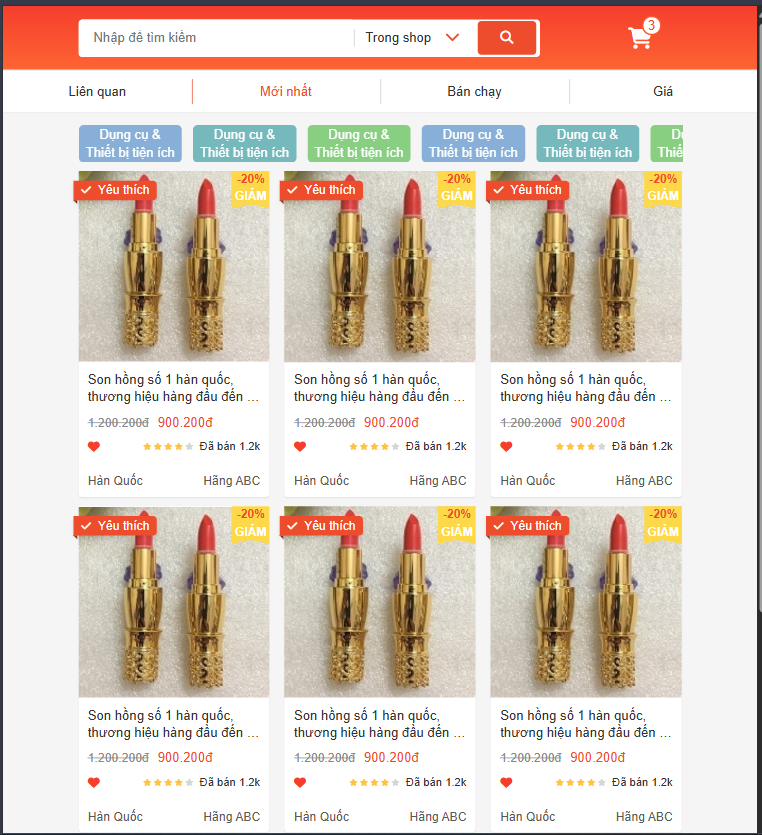
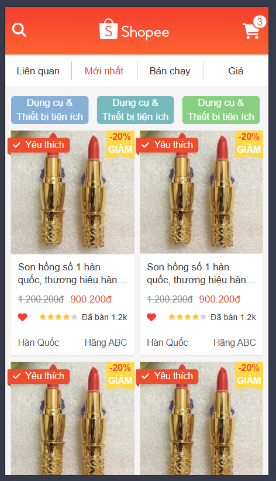

# 🛍️ Shopee Clone

## 📌 Giới thiệu

Dự án **Shopee Clone** được xây dựng với mục đích học tập **HTML, CSS** và rèn luyện kỹ năng **xây dựng giao diện responsive**.
Website mô phỏng lại giao diện cơ bản của Shopee với các thành phần như: header, thanh điều hướng, danh sách sản phẩm, giỏ hàng (trạng thái rỗng), thông báo và footer.

👉 Đây là dự án **web tĩnh**, không có backend, chỉ tập trung vào giao diện.

---

## 🚀 Tính năng

* Thiết kế giao diện giống Shopee.
* Hỗ trợ **responsive** trên 3 loại màn hình:

  * 🖥️ PC
  * 💻 Tablet
  * 📱 Mobile
* **Grid system custom** dựa trên ý tưởng của Bootstrap 4.
* Sử dụng **FontAwesome** để hiển thị icon.
* Các phần chính:

  * Thanh tìm kiếm
  * Giỏ hàng
  * Thông báo
  * Liên kết tải ứng dụng (App Store, Google Play, App Gallery)
  * Footer

---

## 🛠️ Công nghệ sử dụng

* **HTML5**
* **CSS3 (Flexbox, Grid)**
* **Responsive Design**
* **FontAwesome**

---

## 📂 Cấu trúc thư mục

```bash
F8-Shop-v1/
│── index.html          # Trang chính
│
└── assets/
    ├── css/
    │   ├── base.css        # Các reset, biến màu, font chung
    │   ├── grid.css        # Grid system custom
    │   ├── main.css        # Style chính
    │   └── responsive.css  # Style cho responsive (PC, Tablet, Mobile)
    │
    ├── fonts/
    │   └── fontawesome-free-6.7.2-web/   # Thư viện FontAwesome
    │
    └── img/
        ├── notify/         # Icon/thông báo
        ├── app-store.png
        ├── app-gallery.png
        ├── cat_avatar.jpg
        ├── google_play.png
        ├── no_cart.png
        ├── notify2.png
        └── qr_code.png
```

---

## ⚡ Cách chạy dự án

1. Clone project:

   ```bash
   git clone https://github.com/TaLePhu/my_shopee.git
   ```
2. Mở file `index.html` bằng trình duyệt (Chrome/Firefox).

👉 Không cần cài đặt thêm vì đây là **web tĩnh**.

---

## 📱 Demo giao diện

| 🖥️ PC                                                                                           | 💻 Tablet                             | 📱 Mobile                             |
| ------------------------------------------------------------------------------------------------ | ------------------------------------- | ------------------------------------- |
|  <br>  |  |  |

---

## 🎯 Mục tiêu học tập

* Hiểu cách tổ chức HTML + CSS cho dự án thực tế.
* Thực hành xây dựng **giao diện responsive**.
* Rèn kỹ năng tự custom **grid system** thay vì dùng trực tiếp Bootstrap.

---

## 📜 License


